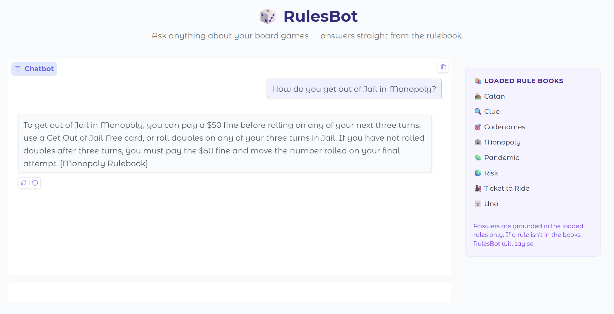
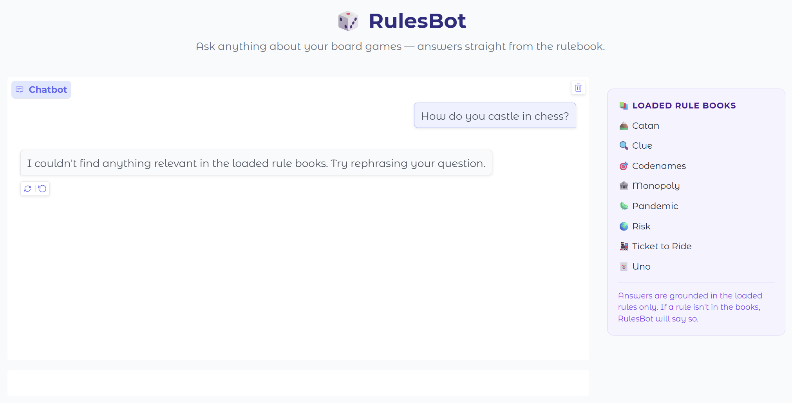
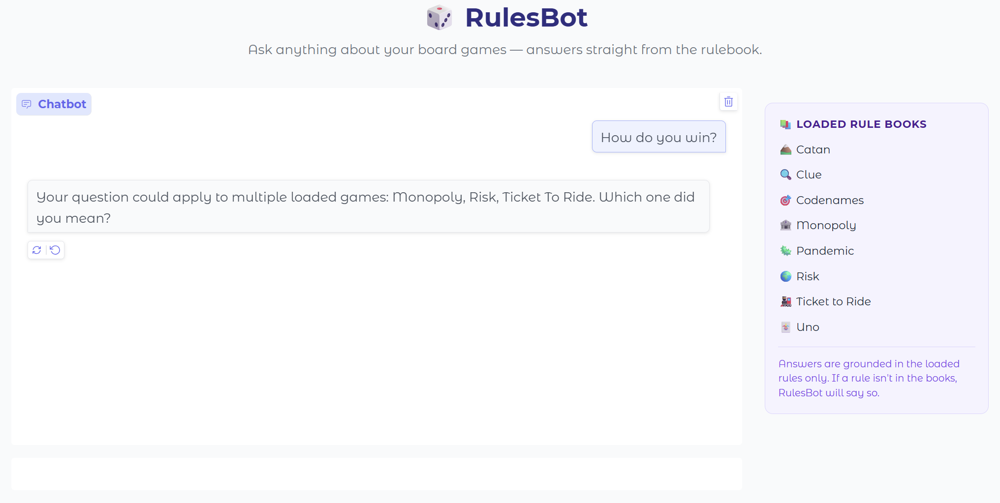

# 🎲 RulesBot

> A board game rules assistant — because "just read the rulebook" isn't always helpful at 11pm on game night.

RulesBot answers natural-language questions about board game rules using a **RAG** (Retrieval-Augmented Generation) pipeline. It retrieves the most relevant passages from a set of rulebooks and generates an answer grounded strictly in that text — never in the model's general knowledge.

Built as **Lab 1 of CodePath AI201**. The Gradio UI and infrastructure were provided; the retrieval and generation pipeline (`retrieve()` and `generate_response()`) is my implementation. The reasoning behind each design decision lives in `specs/`.

---

## Demo

Normal query - mentions the game name clearly and asks a question directly addressed by the rulebook corpus:



Off-topic query - asks an irrelevant question whose answer is not in the rulebook corpus:



Game-agnostic query - does not name a game and asks about rules common to multiple games:



---

## How It Works

```
docs/*.txt  →  chunk  →  embed + store  →  retrieve  →  generate  →  answer
```

1. **Chunk** (`ingest.py`) — each rulebook is split into ~300-char overlapping windows so a rule that spans a boundary stays retrievable.
2. **Embed + store** (`retriever.py`) — chunks are embedded with `all-MiniLM-L6-v2` and persisted in a local ChromaDB collection (cosine distance).
3. **Retrieve** (`retriever.py`) — the query is embedded and matched against the store; the top results are filtered by a relevance threshold and returned ranked by distance.
4. **Generate** (`generator.py`) — the retrieved chunks are formatted into a grounded prompt and sent to a Groq-hosted Llama 3.3 model, which answers using only that context.

---

## Design Highlights

- **Grounded by construction.** The system prompt forbids outside knowledge; if the answer isn't in the retrieved chunks, RulesBot says so rather than guessing.
- **Game-scoped retrieval.** When a query unambiguously names one of the loaded games, search is scoped to that game's chunks so rules from other games can't bleed in.
- **Relevance threshold (0.60).** Chunks beyond an empirically chosen cosine distance are dropped before they reach the model — a first line of defense against confidently wrong answers on vague queries.
- **Multi-game disambiguation.** When retrieved chunks span more than one game, RulesBot returns a deterministic clarification ("which game did you mean?") instead of arbitrarily picking one — no API call needed.
- **Citations.** Answers end with the source game, e.g. `[Catan Rulebook]`.
- **Low temperature (0.2).** Favors faithful extraction over creative phrasing.
- **Prompt-injection guard.** Query and chunk text are treated as data, never as instructions.

## Known Limitations

- The relevance threshold is hardcoded and tied to the current embedding model — it would need re-tuning if the model or corpus changes. (A reranker would be the production fix.)
- Multi-game detection only surfaces ambiguity that appears in the _retrieved_ chunks. A query ambiguous to a human but dominated by one game in embedding space (e.g. "How do I draw cards?" → all Uno) won't trigger clarification.
- Game-name detection is keyword-based, so typos, abbreviations, or alternate capitalizations of game names may be missed.

---

## Getting Started

### 1. Create a virtual environment

```bash
python -m venv .venv
source .venv/bin/activate      # Mac/Linux
# or: .venv\Scripts\activate   # Windows
```

### 2. Install dependencies

```bash
pip install -r requirements.txt
```

> **Note:** `sentence-transformers` downloads the embedding model (~80MB) on first run, then caches it locally.

### 3. Add your Groq API key

```bash
cp .env.example .env
```

Open `.env` and replace `your_key_here` with your key from [console.groq.com](https://console.groq.com). No credit card required.

### 4. Run the app

```bash
python app.py       # or `python3 app.py`
```

RulesBot starts and opens in your browser.

---

## Project Structure

```
ai201-lab1-rulesbot-starter/
├── app.py          # Gradio UI and startup logic
├── config.py       # Settings (models, paths, retrieval params)
├── ingest.py       # Document loading + chunking
├── retriever.py    # Vector store + semantic search
├── generator.py    # Grounded LLM response generation
├── docs/           # Board game rule documents
├── specs/          # Design documents — the "why" behind each stage
└── planning.md     # Observations and reflections
```

---

## Re-ingesting After Changes

ChromaDB persists to `./chroma_db`. If you change the chunking strategy and want to re-ingest, delete that folder and restart:

```bash
rm -rf chroma_db/   # Mac/Linux
# or: rmdir /s chroma_db   # Windows
python app.py
```

---

## Rule Books Included

| Game           | File                      |
| -------------- | ------------------------- |
| Catan          | `docs/catan.txt`          |
| Clue           | `docs/clue.txt`           |
| Codenames      | `docs/codenames.txt`      |
| Monopoly       | `docs/monopoly.txt`       |
| Pandemic       | `docs/pandemic.txt`       |
| Risk           | `docs/risk.txt`           |
| Ticket to Ride | `docs/ticket_to_ride.txt` |
| Uno            | `docs/uno.txt`            |
